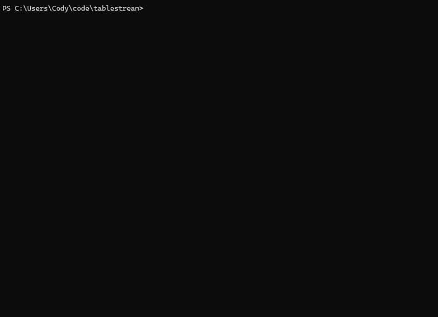

TableStream
===========

Stream data to the terminal and display it in ASCII tables.

TableStream will initially buffer some rows and use them to automatically
determine appropriate widths for columns. It will try to automatically detect
the current terminal's width and fit the rows into that width.

After that, it clears the buffer and just streams data directly to your output.
(An `io::Write`)

See the [API Docs] for code examples. Install from [crates.io].

[API Docs]: https://docs.rs/tablestream
[crates.io]: https://crates.io/crates/tablestream

Current Limitations
-------------------

 * Doesn't handle right-to-left text. (Have tips on doing this in a terminal!?)
 * Emoji aren't handled.
 * Bengali seems to not render properly in Widnows terminal, so that's not supported.
   (Though maybe it'll work for you elsewhere?)

Future Features?
----------------

 * Could add options for colors.

